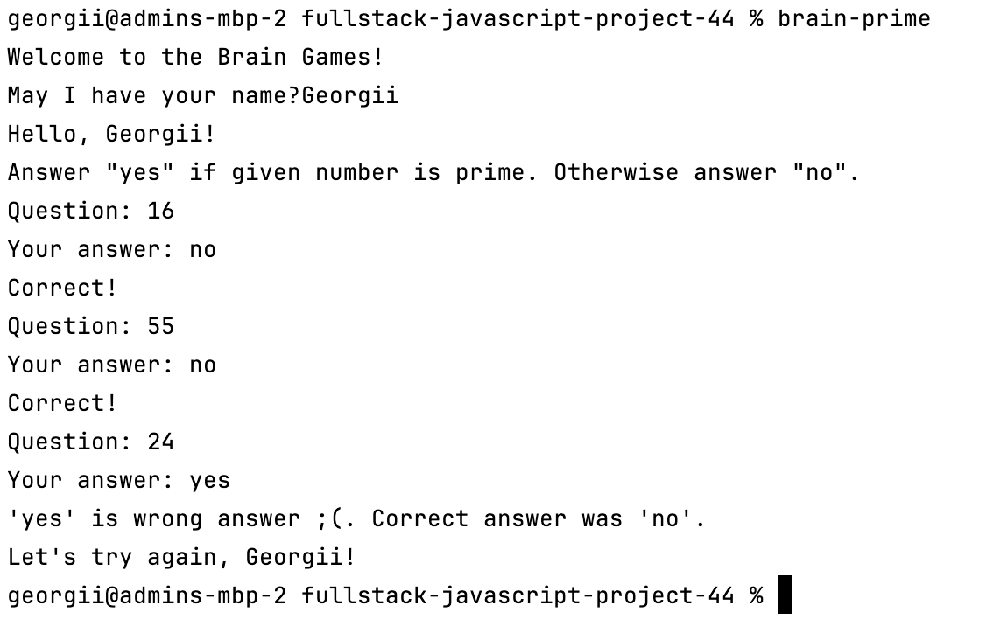

# Игры разума на JS
[](https://github.com/honest-niceman/fullstack-javascript-project-44/actions)
[](https://codeclimate.com/github/honest-niceman/fullstack-javascript-project-44/maintainability)

## Описание

«Игры разума» — набор из пяти консольных игр, построенных по принципу 
популярных мобильных приложений для прокачки мозга. Каждая игра задает вопросы, 
на которые нужно дать правильные ответы. После трех правильных ответов считается, 
что игра пройдена. Неправильные ответы завершают игру и предлагают пройти ее заново. 

Игры:
* Калькулятор. Арифметические выражения, которые необходимо вычислить.
* Прогрессия. Поиск пропущенных чисел в последовательности чисел.
* Определение четного числа.
* Определение наибольшего общего делителя.
* Определение простого числа.

## Использование

Эта команда полезна при первом клонировании репозитория (или после удаления node_modules).

```makefile
install:
	npm ci
```

Команда `publishAndLink` полезна во время разработки приложения. 

После реализации новой игры и запуска команды `publishAndLink` произойдет:
* Проверка линтером (`lint`)
* Публикация в учебный репозиторий (`publish`)
* И установка на локальную машину (`link`)

```makefile
publish:
	npm publish --dry-run

link:
	echo DEFdckhiHjrJ | sudo -S sudo npm link

lint:
	npx eslint .

publishAndLink: lint publish link
```

Запустить любую из существующих игр можно используя терминал:

```makefile
brain-games:
	node bin/brain-games.js

brain-even:
	node bin/brain-even.js

brain-calc:
	node bin/brain-calc.js

brain-gcd:
	node bin/brain-gcd.js

brain-prime:
	node bin/brain-prime.js

brain-progression:
	node bin/brain-progression.js
```


